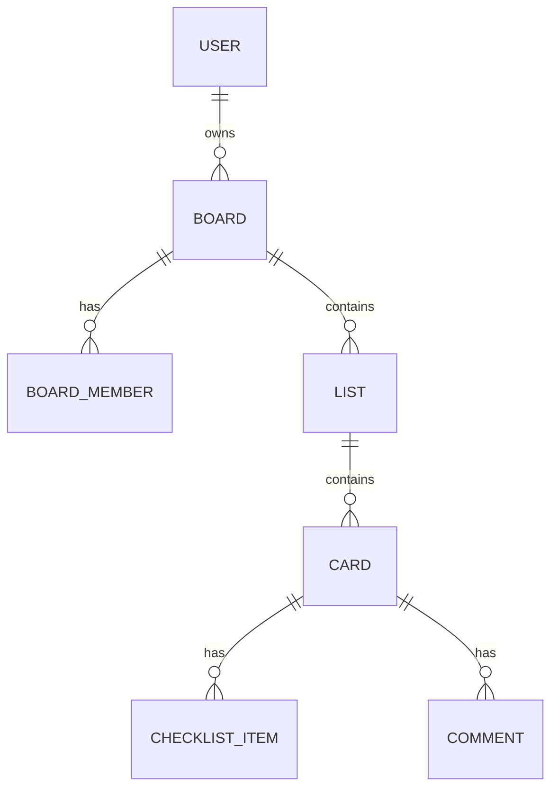

# TaskSync - Trello-Inspired Features

This document describes the TaskSync features added to the FastAPI application.

---

## Overview

TaskSync transforms the todo app into a Kanban task management system with:
- **Boards** - Project containers with collaboration
- **Lists** - Kanban columns within boards
- **Labels** - Color-coded tags for cards
- **Cards** - Enhanced todos with assignments and due dates
- **Checklists** - Sub-tasks within cards
- **Comments** - Activity logs on cards

---

## Data Model



---

## Phase 1: Boards + Collaboration ✅

### Board Model

| Column | Type | Description |
|--------|------|-------------|
| `id` | Integer | Primary key |
| `name` | String(100) | Board name |
| `description` | String(500) | Optional description |
| `color` | String(7) | Hex color (default: #3B82F6) |
| `owner_id` | FK → users.id | Board creator |
| `created_at` | DateTime | Auto-set |

### BoardMember Model

| Column | Type | Description |
|--------|------|-------------|
| `board_id` | FK, PK | Board reference |
| `user_id` | FK, PK | User reference |
| `role` | Enum | "admin" / "member" |
| `joined_at` | DateTime | Auto-set |

### API Endpoints

| Method | Endpoint | Description |
|--------|----------|-------------|
| POST | `/boards/` | Create board (creator becomes admin) |
| GET | `/boards/` | List boards (owned + member) |
| GET | `/boards/{id}` | Get board with members |
| PUT | `/boards/{id}` | Update board (admin only) |
| DELETE | `/boards/{id}` | Delete board + cascade (owner only) |
| POST | `/boards/{id}/members` | Add member (admin only) |
| DELETE | `/boards/{id}/members/{user_id}` | Remove member |

---

## Phase 2: Lists (Kanban Columns) ✅

### List Model

| Column | Type | Description |
|--------|------|-------------|
| `id` | Integer | Primary key |
| `name` | String(100) | List name (e.g., "To Do", "In Progress") |
| `position` | Integer | Order within board (0-indexed) |
| `board_id` | FK → boards.id | Parent board (CASCADE delete) |
| `created_at` | DateTime | Auto-set |

### Schemas

**ListCreate**
```python
class ListCreate(BaseModel):
    name: str  # min_length=1, max_length=100
    position: Optional[int] = None  # Auto-calculated if not provided
```

**ListUpdate**
```python
class ListUpdate(BaseModel):
    name: Optional[str] = None
```

**ListMove**
```python
class ListMove(BaseModel):
    position: int  # ge=0
```

**ListResponse**
```python
class ListResponse(BaseModel):
    id: int
    name: str
    position: int
    board_id: int
    created_at: Optional[datetime]
```

### API Endpoints

| Method | Endpoint | Description |
|--------|----------|-------------|
| POST | `/boards/{board_id}/lists` | Create list (auto-position if not provided) |
| GET | `/boards/{board_id}/lists` | Get all lists ordered by position |
| GET | `/lists/{id}` | Get single list |
| PUT | `/lists/{id}` | Update list name |
| DELETE | `/lists/{id}` | Delete list + cascade cards |
| PATCH | `/lists/{id}/move` | Reorder list position |

### Position Management

Lists are ordered by the `position` field:

| Action | Behavior |
|--------|----------|
| **Create** | `position = max(existing) + 1` |
| **Move** | Shifts affected lists up/down |
| **Delete** | No reorder (gaps allowed) |

**Example: Move list from position 2 → 0**
```
Before: To Do(0), In Progress(1), Done(2)
After:  Done(0), To Do(1), In Progress(2)
```

### Access Control

- Only **board members** can view/modify lists
- Lists inherit permissions from parent board

### Files

| File | Purpose |
|------|---------|
| `models/list.py` | List model with position helpers |
| `schemas/list_schema.py` | Create, Update, Move, Response schemas |
| `services/list_service.py` | CRUD + position management |
| `controllers/list_controller.py` | Route ↔ Service bridge |
| `api/v1/routes/list_routes.py` | API endpoints |

---

## Phase 3: Labels ✅

### Label Model

| Column | Type | Description |
|--------|------|-------------|
| `id` | Integer | Primary key |
| `name` | String(50) | Label name (e.g., "Bug", "Feature") |
| `color` | String(7) | Hex color (e.g., #FF0000) |
| `board_id` | FK → boards.id | Parent board (CASCADE delete) |
| `created_at` | DateTime | Auto-set |

### CardLabel Model (Junction Table)

| Column | Type | Description |
|--------|------|-------------|
| `card_id` | FK, PK | Card reference |
| `label_id` | FK, PK | Label reference |
| `created_at` | DateTime | Auto-set |

### Schemas

**LabelCreate**
```python
class LabelCreate(BaseModel):
    name: str  # min_length=1, max_length=50
    color: str  # Hex pattern: ^#[0-9A-Fa-f]{6}$
```

**LabelUpdate**
```python
class LabelUpdate(BaseModel):
    name: Optional[str] = None
    color: Optional[str] = None
```

**LabelResponse**
```python
class LabelResponse(BaseModel):
    id: int
    name: str
    color: str
    board_id: int
    created_at: Optional[datetime]
```

### API Endpoints

| Method | Endpoint | Description |
|--------|----------|-------------|
| POST | `/boards/{board_id}/labels` | Create label |
| GET | `/boards/{board_id}/labels` | Get all labels for board |
| GET | `/labels/{id}` | Get single label |
| PUT | `/labels/{id}` | Update label name/color |
| DELETE | `/labels/{id}` | Delete label |
| POST | `/cards/{card_id}/labels/{label_id}` | Attach label to card |
| DELETE | `/cards/{card_id}/labels/{label_id}` | Detach label from card |

### Access Control

- Only **board members** can view/modify labels
- Labels are board-scoped (each board has its own set)
- Card attachment endpoints require label to be from same board

### Files

| File | Purpose |
|------|---------|
| `models/label.py` | Label + CardLabel models |
| `schemas/label_schema.py` | Create, Update, Response schemas |
| `services/label_service.py` | CRUD + attach/detach logic |
| `controllers/label_controller.py` | Route ↔ Service bridge |
| `api/v1/routes/label_routes.py` | API endpoints |

---

## Phase 4: Cards (Enhanced Todo) ✅

### Card Model (Enhanced Todo)

| Column | Type | Description |
|--------|------|-------------|
| `id` | Integer | Primary key |
| `title` | String(255) | Card title |
| `description` | String(1000) | Optional details |
| `completed` | Boolean | Done flag |
| `priority` | Enum | HIGH/MEDIUM/LOW |
| `position` | Integer | Order within list (0-indexed) |
| `due_date` | DateTime | Optional deadline |
| `list_id` | FK → lists.id | Parent list (SET NULL on delete) |
| `user_id` | FK → users.id | Creator/author |
| `created_at` | DateTime | Auto-set |
| `updated_at` | DateTime | Auto-updated |

### CardMember Model (Junction Table)

| Column | Type | Description |
|--------|------|-------------|
| `card_id` | FK, PK | Card reference |
| `user_id` | FK, PK | Assignee reference |
| `assigned_at` | DateTime | Auto-set |

### Schemas

**CardCreate**
```python
class CardCreate(BaseModel):
    title: str  # min_length=1, max_length=255
    description: Optional[str] = None
    priority: Priority = Priority.MEDIUM
    due_date: Optional[datetime] = None
    position: Optional[int] = None  # Auto-calculated
```

**CardMove**
```python
class CardMove(BaseModel):
    list_id: Optional[int] = None  # Move to different list
    position: int  # ge=0
```

**CardResponse**
```python
class CardResponse(BaseModel):
    id, title, description, completed, priority
    position, due_date, list_id, user_id
    created_at, updated_at
```

### API Endpoints

| Method | Endpoint | Description |
|--------|----------|-------------|
| POST | `/lists/{list_id}/cards` | Create card (auto-position) |
| GET | `/lists/{list_id}/cards` | Get cards ordered by position |
| GET | `/cards/{id}` | Get card with members & labels |
| PUT | `/cards/{id}` | Update card fields |
| PATCH | `/cards/{id}/move` | Move to different position/list |
| DELETE | `/cards/{id}` | Delete card |
| POST | `/cards/{id}/members/{user_id}` | Assign user |
| DELETE | `/cards/{id}/members/{user_id}` | Unassign user |

### Position Management

| Action | Behavior |
|--------|----------|
| **Create** | `position = max(existing) + 1` |
| **Move within list** | Shifts affected cards |
| **Move to new list** | Card inserted, shifts target list |

### Access Control

- Cards inherit permissions from parent list's board
- Only board members can view/modify cards

### Files

| File | Purpose |
|------|---------|
| `models/todo.py` | Todo + CardMember models |
| `schemas/todo_schema.py` | Card CRUD + move schemas |
| `services/todo_service.py` | CRUD + move + assign logic |
| `api/v1/routes/card_routes.py` | Card API endpoints |

---

## Files Structure

```
models/
├── board.py        ← Board, BoardMember
├── list.py         ← List (Phase 2)
├── label.py        ← Label, CardLabel (Phase 3)
├── card.py         ← Card, CardMember (Phase 4)
├── checklist.py    ← ChecklistItem (Phase 5)
└── comment.py      ← Comment (Phase 6)

schemas/
├── board_schema.py
├── list_schema.py
├── label_schema.py
├── card_schema.py
├── checklist_schema.py
└── comment_schema.py

services/
├── board_service.py
├── list_service.py
...

api/v1/routes/
├── board_routes.py
├── list_routes.py
...
```

---

## Usage Examples

### Create a Board

```bash
curl -X POST /api/v1/boards/ \
  -H "Authorization: Bearer <token>" \
  -d '{"name": "Project Alpha", "color": "#FF5733"}'
```

### Create Lists in Board

```bash
curl -X POST /api/v1/boards/1/lists \
  -H "Authorization: Bearer <token>" \
  -d '{"name": "To Do"}'

curl -X POST /api/v1/boards/1/lists \
  -H "Authorization: Bearer <token>" \
  -d '{"name": "In Progress"}'

curl -X POST /api/v1/boards/1/lists \
  -H "Authorization: Bearer <token>" \
  -d '{"name": "Done"}'
```

### Reorder List

```bash
curl -X PATCH /api/v1/lists/2/move \
  -H "Authorization: Bearer <token>" \
  -d '{"position": 0}'
```
