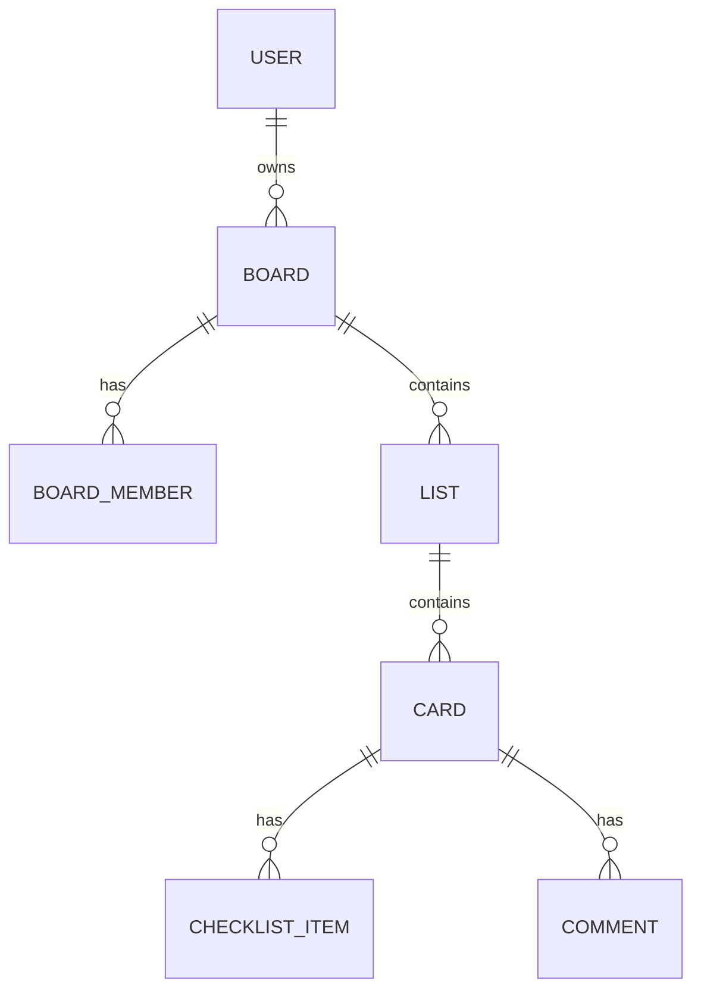

# TaskSync - Trello-Inspired Features

This document describes the TaskSync features added to the FastAPI application.

---

## Overview

TaskSync transforms the todo app into a Kanban task management system with:
- **Boards** - Project containers with collaboration
- **Lists** - Kanban columns within boards
- **Labels** - Color-coded tags for cards
- **Cards** - Enhanced todos with assignments and due dates
- **Checklists** - Sub-tasks within cards
- **Comments** - Activity logs on cards

---

## Data Model



---

## Phase 1: Boards + Collaboration ✅

### Board Model

| Column | Type | Description |
|--------|------|-------------|
| `id` | Integer | Primary key |
| `name` | String(100) | Board name |
| `description` | String(500) | Optional description |
| `color` | String(7) | Hex color (default: #3B82F6) |
| `owner_id` | FK → users.id | Board creator |
| `created_at` | DateTime | Auto-set |

### BoardMember Model

| Column | Type | Description |
|--------|------|-------------|
| `board_id` | FK, PK | Board reference |
| `user_id` | FK, PK | User reference |
| `role` | Enum | "admin" / "member" |
| `joined_at` | DateTime | Auto-set |

### API Endpoints

| Method | Endpoint | Description |
|--------|----------|-------------|
| POST | `/boards/` | Create board (creator becomes admin) |
| GET | `/boards/` | List boards (owned + member) |
| GET | `/boards/{id}` | Get board with members |
| PUT | `/boards/{id}` | Update board (admin only) |
| DELETE | `/boards/{id}` | Delete board + cascade (owner only) |
| POST | `/boards/{id}/members` | Add member (admin only) |
| DELETE | `/boards/{id}/members/{user_id}` | Remove member |

---

## Phase 2: Lists (Kanban Columns)

### List Model

| Column | Type | Description |
|--------|------|-------------|
| `id` | Integer | Primary key |
| `name` | String(100) | List name (e.g., "To Do", "In Progress") |
| `position` | Integer | Order within board (0-indexed) |
| `board_id` | FK → boards.id | Parent board |
| `created_at` | DateTime | Auto-set |

### API Endpoints

| Method | Endpoint | Description |
|--------|----------|-------------|
| POST | `/boards/{board_id}/lists` | Create list |
| GET | `/boards/{board_id}/lists` | Get all lists for board |
| PUT | `/lists/{id}` | Update list name |
| DELETE | `/lists/{id}` | Delete list + cascade cards |
| PATCH | `/lists/{id}/move` | Reorder list position |

### Position Management

Lists are ordered by the `position` field. When:
- **Creating**: New lists get `position = max(existing) + 1`
- **Reordering**: Update positions of affected lists
- **Deleting**: No reorder needed (gaps allowed)

### Access Control

- Only **board members** can view/modify lists
- Lists inherit permissions from parent board

---

## Files Structure

```
models/
├── board.py        ← Board, BoardMember
├── list.py         ← List (Phase 2)
├── label.py        ← Label, CardLabel (Phase 3)
├── card.py         ← Card, CardMember (Phase 4)
├── checklist.py    ← ChecklistItem (Phase 5)
└── comment.py      ← Comment (Phase 6)

schemas/
├── board_schema.py
├── list_schema.py
├── label_schema.py
├── card_schema.py
├── checklist_schema.py
└── comment_schema.py

services/
├── board_service.py
├── list_service.py
...

api/v1/routes/
├── board_routes.py
├── list_routes.py
...
```

---

## Usage Examples

### Create a Board

```bash
curl -X POST /api/v1/boards/ \
  -H "Authorization: Bearer <token>" \
  -d '{"name": "Project Alpha", "color": "#FF5733"}'
```

### Create Lists in Board

```bash
curl -X POST /api/v1/boards/1/lists \
  -H "Authorization: Bearer <token>" \
  -d '{"name": "To Do"}'

curl -X POST /api/v1/boards/1/lists \
  -H "Authorization: Bearer <token>" \
  -d '{"name": "In Progress"}'

curl -X POST /api/v1/boards/1/lists \
  -H "Authorization: Bearer <token>" \
  -d '{"name": "Done"}'
```

### Reorder List

```bash
curl -X PATCH /api/v1/lists/2/move \
  -H "Authorization: Bearer <token>" \
  -d '{"position": 0}'
```
