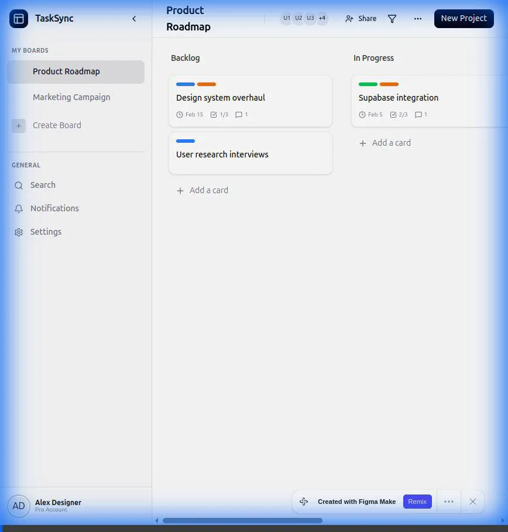
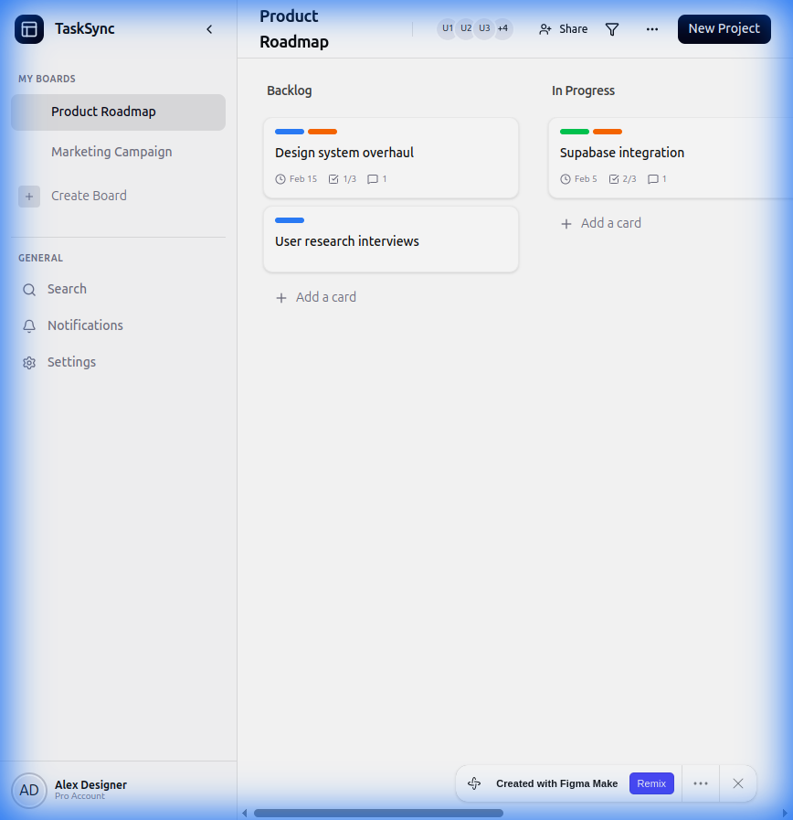
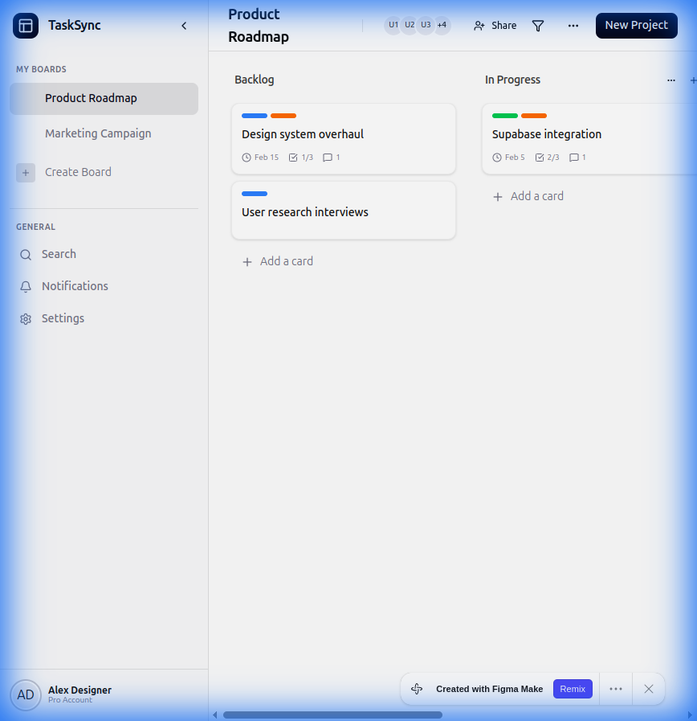
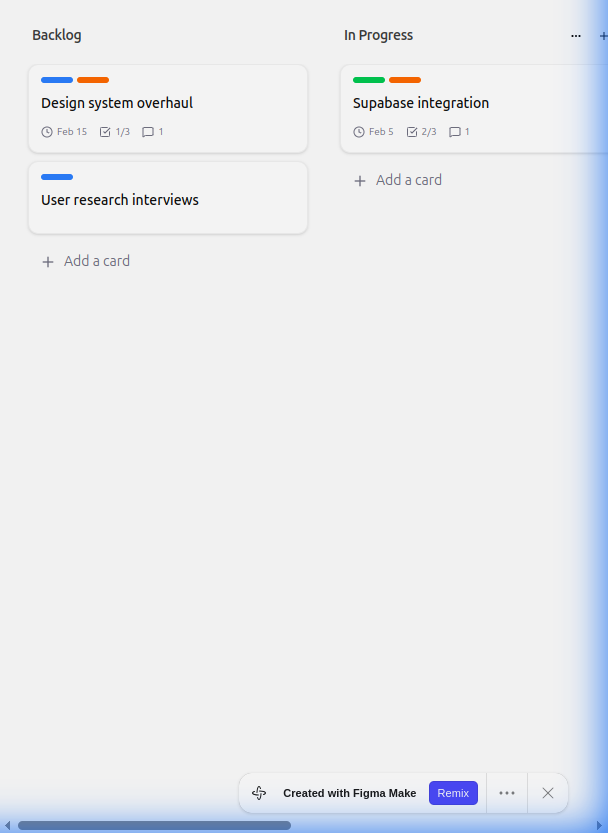
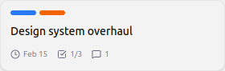
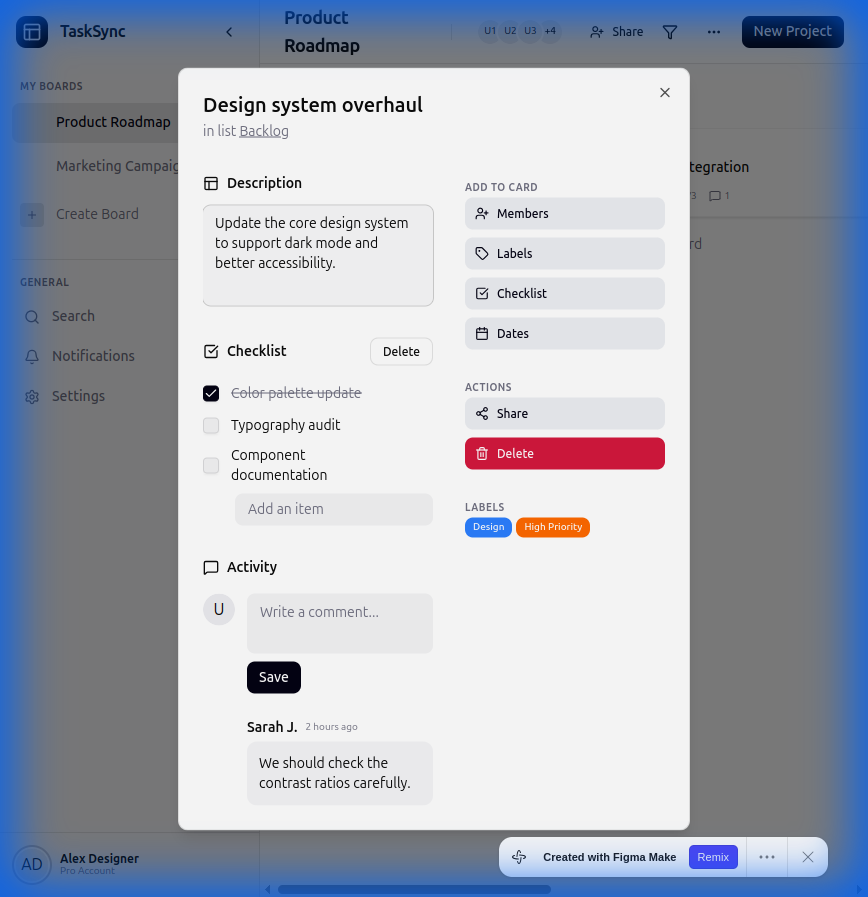
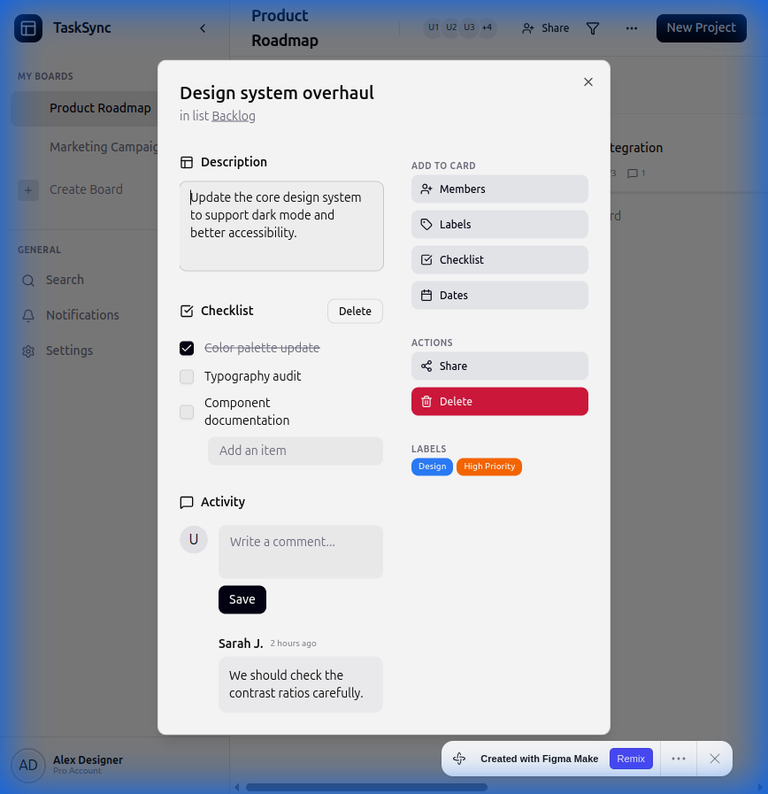

# Frontend Design Specifications & Audio-Visual References 🎨

This document contains the visual references derived from the [Figma Prototype](https://output-ebook-44686284.figma.site/).

*Recording of the Figma design analysis session.*

---

## 1. App Shell (Sidebar & Layout)

**Visual Layout:**
- **Sidebar**: Dark theme, fixed width, specific navigation hierarchy.
- **Main Content**: Light background, fluid width.

*Full application layout showing sidebar navigation and user profile.*

---

## 2. Board View

**Visual Layout:**
- **Header**: Board title, member avatars, settings.
- **Canvas**: Horizontal scrolling lists.

*Board layout with header and horizontal Kanban columns.*

---

## 3. List Component

**Visual Layout:**
- **Header**: Column title, options menu.
- **Body**: Stack of cards with spacing.
- **Footer**: "Add a card" action.

*A single Kanban list column containing multiple task cards.*

---

## 4. Card Component

**Visual Layout:**
- **Labels**: Pill identifiers at the top.
- **Content**: Task title.
- **Metadata**: Icons for due date, checklist count, comments count.

*Detailed view of a task card showing labels and metadata icons.*

---

## 5. Checklist Component

**Visual Layout:**
- **Header**: Section title + Delete action.
- **Items**: Checkbox (rounded) + Text (strikethrough when done).
- **Progress**: Visual progress bar (implied).

*Checklist section within the task detail modal.*

---

## 6. Comments Component

**Visual Layout:**
- **Input**: User avatar + Text area + Primary Save button.
- **Thread**: List of comments with user info and timestamp.

*Activity section showing the comment input and history.*
